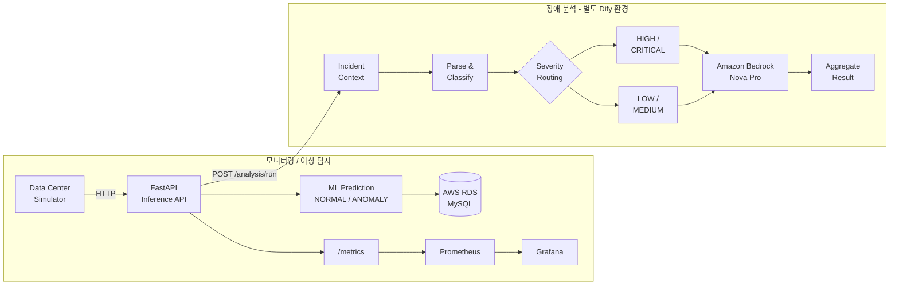
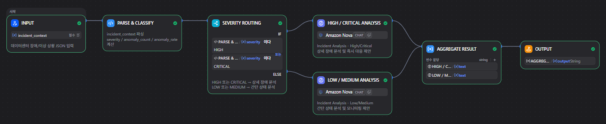
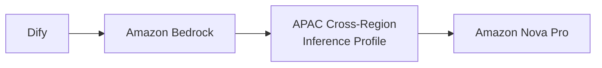
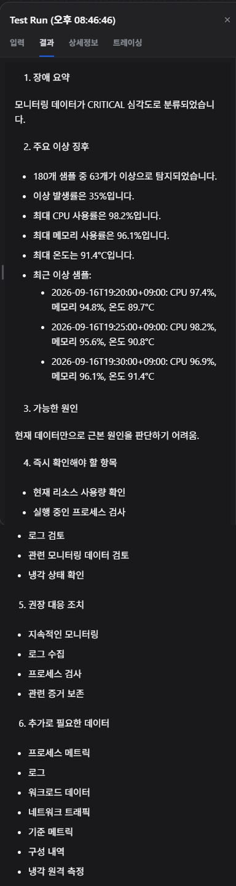

# Kubernetes 기반 데이터센터 AI 모니터링 시스템

데이터센터 서버의 CPU, 메모리, 온도, 전력 사용량을 시뮬레이션하고, 머신러닝으로 이상 여부를 판단하는 프로젝트입니다.

FastAPI 기반 추론 API를 K3s에 배포하고 Prometheus/Grafana로 상태를 모니터링했습니다.  
추가로 Dify와 Amazon Bedrock의 Amazon Nova Pro를 이용해 이상 발생 시 모니터링 데이터를 분석하는 장애 분석 워크플로우를 구성했습니다.

## 전체 구성

아래 두 흐름은 각각 **모니터링/이상 탐지**와 **생성형 AI 장애 분석**을 담당합니다.  
FastAPI가 저장된 측정값을 조회해 self-hosted Dify 워크플로우에 전달합니다.



애플리케이션과 모니터링 구성요소는 AWS EC2의 **single-node K3s** 환경에서 실행됩니다.

## AI 이상 탐지 및 모니터링

시뮬레이션된 서버 측정값을 FastAPI 추론 API로 전달하고 머신러닝 모델을 이용해 `NORMAL` 또는 `ANOMALY`로 분류합니다.

```json
{
  "server_id": "server-002",
  "prediction": "ANOMALY",
  "probability": 1.0
}
```

추론 결과는 AWS RDS(MySQL)에 저장합니다.  
동시에 Prometheus가 수집할 수 있도록 다음 메트릭을 노출합니다.

```text
datacenter_cpu_percent
datacenter_memory_percent
datacenter_temperature_celsius
datacenter_power_watts
datacenter_predictions_total
datacenter_anomalies_total
```

Grafana에서는 서버별 CPU, 메모리, 온도, 전력 사용량과 Prediction Status, Anomaly Rate를 확인할 수 있습니다.


대시보드 설정:

```text
grafana/dashboards/datacenter-monitoring-dashboard.json
```

## Dify를 이용한 장애 분석

기존 머신러닝 모델은 이상 여부를 분류하는 역할까지 담당합니다.  
이상 탐지 이후 운영자가 확인할 내용을 정리하기 위해 별도의 Dify 장애 분석 워크플로우를 추가했습니다.



입력된 장애 컨텍스트를 파싱한 뒤 `anomaly_rate`와 `anomaly_count`를 기준으로 심각도를 계산합니다.

| 조건 | Severity |
|---|---|
| `anomaly_rate >= 0.30` | `CRITICAL` |
| `anomaly_rate >= 0.15` | `HIGH` |
| `anomaly_count > 0` | `MEDIUM` |
| 그 외 | `LOW` |

`HIGH / CRITICAL`은 상세 분석 경로로, `LOW / MEDIUM`은 간단한 상태 확인 경로로 분기합니다.

프롬프트에서는 입력에 없는 원인을 임의로 확정하지 않도록 했습니다. 관측된 사실과 가설을 구분하고, 현재 데이터만으로 근본 원인을 판단하기 어려운 경우에는 이를 명시하도록 구성했습니다.

### Amazon Bedrock 연동

Dify에서는 Amazon Bedrock의 **Amazon Nova Pro**를 사용합니다.



AWS 인증에는 **EC2 IAM Role + Instance Metadata Service(IMDS)**를 사용했습니다.

- Dify에 AWS Access Key / Secret Access Key를 직접 저장하지 않음
- Bedrock 호출 권한을 최소 권한 IAM Policy로 제한
- 승인한 APAC Nova Pro inference profile을 통한 호출만 허용

### FastAPI에서 분석 요청

```bash
curl -X POST http://localhost:8000/analysis/run \
  -H 'Content-Type: application/json' \
  -d '{"server_id":"server06","minutes":30,"anomaly_limit":5}'
```

주소는 실행 중인 FastAPI 주소로 바꿉니다. `{}`를 보내면 전체 서버의 최근 30분과 최근 이상 5건을 사용합니다.
`GET /analysis/context`로 같은 조회 조건의 입력 데이터를 먼저 확인할 수 있습니다.

- 성공: `status=succeeded`, `workflow_run_id`, `context`, `outputs.analysis_result`를 반환합니다. 분석 결과는 문자열입니다.
- 데이터 없음: HTTP 200과 `status=skipped`, `reason=no_data`, `workflow_run_id=null`, `outputs=null`을 반환하며 Dify를 호출하지 않습니다.
- 타임아웃: HTTP 504를 반환합니다. Workflow가 계속 실행될 수 있으므로 자동 재호출하지 말고 Dify 실행 상태부터 확인합니다.

`/predict`는 분석을 자동 실행하지 않습니다. 분석은 위 POST 요청으로 실행합니다.

2026-09-16에 K3s 배포 후 Pod 2개의 readiness와 `/analysis/context` HTTP 200을 확인했습니다.
데이터가 있는 서버로 실제 Dify/Bedrock 연동을 1회 실행해 `succeeded`, 실행 ID, 비어 있지 않은 분석 문자열을 확인했습니다.
기존 CRITICAL 경로 검증 결과는 아래 이미지에 정리했습니다.



입력 제한, 오류 응답, 설정 및 롤백은 [FastAPI–Dify 연동 문서](docs/dify-fastapi-integration.md)를 참고하세요.

## Kubernetes에서 확인한 내용

K3s에 배포한 뒤 정상 실행 여부만 확인하지 않고, Pod 삭제·통신 제한·CPU 부하·K3s 재시작 상황을 직접 만들어 동작을 확인했습니다.

### Self-Healing

`datacenter-api` Deployment가 관리하는 FastAPI Pod 하나를 삭제한 뒤 새 Pod가 자동 생성되고 다시 2개의 running replica를 유지하는 것을 확인했습니다.

```text
Pod 삭제
  → Terminating
  → Deleted
  → New Pod Pending
  → ContainerCreating
  → Running (1/1)
```

### NetworkPolicy

Data Center Simulator의 불필요한 outbound 통신을 제한했습니다.

- Kubernetes DNS: TCP/UDP 53 허용
- `datacenter-api` Pod: TCP 8000 허용

정책 적용 여부는 다음과 같이 확인했습니다.

```text
Simulator -> API with NetworkPolicy        : HTTP 200
Simulator -> Prometheus with NetworkPolicy : blocked
Simulator -> Prometheus without Policy     : HTTP 200
```

### Horizontal Pod Autoscaling

`datacenter-api` Deployment에 HPA를 적용했습니다.

```text
Minimum replicas       : 2
Maximum replicas       : 3
Target CPU utilization : 20%
CPU request per Pod    : 100m
```

부하 테스트에서 CPU 사용률이 목표값을 초과하자 API Pod가 **2 → 3**으로 증가했고, 부하 종료 후 다시 **3 → 2**로 감소했습니다. 테스트 중 CPU 사용률은 약 334%까지 증가했습니다.

### K3s 재시작 후 복구

K3s를 직접 재시작한 뒤 애플리케이션과 모니터링 구성요소가 다시 동작하는지 확인했습니다.

```bash
sudo systemctl restart k3s
```

확인 항목:

- K3s service: `active`
- Kubernetes node: `Ready`
- `datacenter-api` Pod 2개 동작
- Data Center Simulator 동작
- Prometheus / Grafana / Grafana Image Renderer 동작
- HPA CPU metric 수집 재개
- Simulator → FastAPI: HTTP 200
- 새로운 측정 데이터의 AWS RDS(MySQL) 저장 지속

현재 환경은 **single-node K3s**이므로 위 테스트는 K3s 서비스 재시작 이후 애플리케이션 복구를 확인한 것입니다.  
EC2 인스턴스 자체 장애까지 견디는 인프라 수준의 High Availability 구성은 아닙니다.

## 사용 기술

| 구분 | 기술 |
|---|---|
| Cloud | AWS EC2, AWS RDS(MySQL), Amazon Bedrock |
| Container / Orchestration | Docker, Kubernetes(K3s), Helm |
| Backend / ML | Python, FastAPI, scikit-learn |
| Monitoring | Prometheus, Grafana |
| Generative AI | Dify, Amazon Nova Pro |
| Database | MySQL |

## 프로젝트 구조

```text
datacenter-project/
├── backend/
├── k8s/
│   ├── configmap.yaml
│   ├── deployment.yaml
│   ├── service.yaml
│   ├── namespaces.yaml
│   ├── simulator-configmap.yaml
│   ├── simulator-deployment.yaml
│   ├── prometheus-values.yaml
│   └── grafana-values.yaml
├── grafana/
│   ├── dashboards/
│   │   └── datacenter-monitoring-dashboard.json
│   └── screenshots/
│       └── datacenter-monitoring-dashboard.png
├── docs/
│   └── images/
│       ├── dify-workflow.png
│       └── dify-critical-test-result.png
├── requirements.txt
└── README.md
```
