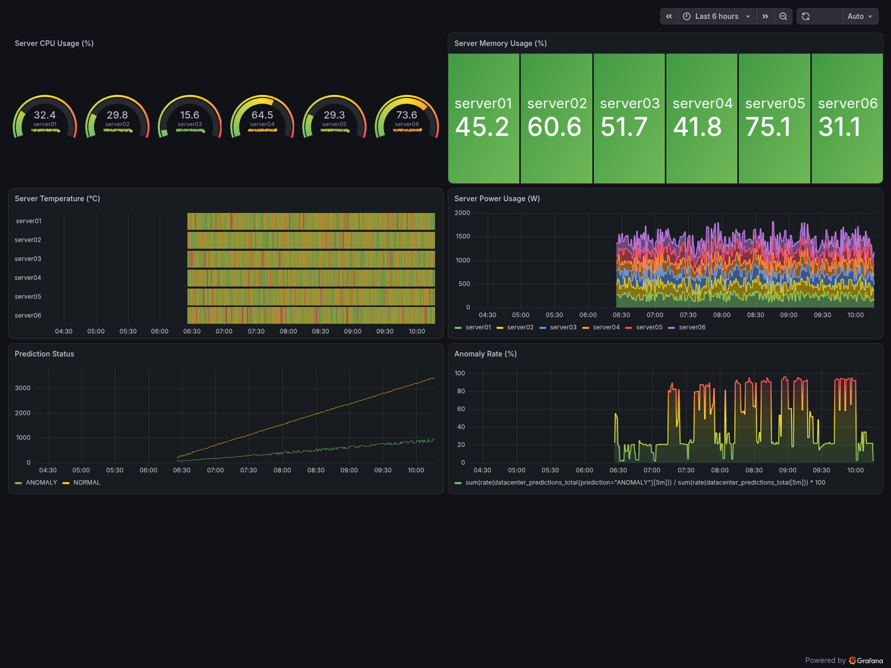

# Kubernetes-based Data Center AI Monitoring System

A Kubernetes-based monitoring project that simulates data center server metrics, performs AI-based anomaly detection, and visualizes the results using Prometheus and Grafana.

## Project Overview

This project simulates multiple data center servers and continuously generates infrastructure metrics such as CPU usage, memory usage, temperature, and power consumption.

The generated metrics are processed by an AI inference API and monitored through Prometheus and Grafana.

## Architecture

```text
Data Center Simulator
        |
        | HTTP
        v
FastAPI Inference Server
        |
        | AI Prediction
        v
Normal / Anomaly Detection
        |
        +--------------------+
        |                    |
        v                    v
      MySQL              /metrics
       RDS                   |
                             v
                        Prometheus
                             |
                             v
                          Grafana
```

The application and monitoring components run on a single-node K3s cluster hosted on AWS EC2.

## Tech Stack

- AWS EC2
- AWS RDS (MySQL)
- Kubernetes (K3s)
- Docker
- Python
- FastAPI
- scikit-learn
- Prometheus
- Grafana
- Helm

## AI Anomaly Detection

A machine learning model is used to classify simulated server measurements as:

- `NORMAL`
- `ANOMALY`

The inference server receives server measurements and returns the prediction result.

Example:

```json
{
  "server_id": "server-002",
  "prediction": "ANOMALY",
  "probability": 1.0
}
```

## Prometheus Metrics

The application exposes metrics that are collected by Prometheus.

```text
datacenter_cpu_percent
datacenter_memory_percent
datacenter_temperature_celsius
datacenter_power_watts
datacenter_predictions_total
datacenter_anomalies_total
```

## Grafana Monitoring Dashboard

The Grafana dashboard visualizes:

- Server CPU Usage
- Server Memory Usage
- Server Temperature
- Server Power Usage
- Prediction Status
- Anomaly Rate



Dashboard JSON:

```text
grafana/dashboards/datacenter-monitoring-dashboard.json
```

The exported JSON can be imported into another Grafana instance to recreate the dashboard.

## Kubernetes

The project is deployed to a single-node K3s cluster.

Main Kubernetes resources include:

- Namespace
- Deployment
- Service
- ConfigMap
- Secret
- PersistentVolumeClaim

Monitoring components are deployed using Helm.

```text
Grafana
Prometheus
Grafana Image Renderer
```

## Kubernetes Self-Healing

Kubernetes self-healing was verified by manually deleting one of the FastAPI Pods managed by the `datacenter-api` Deployment.

The deleted Pod was automatically replaced by Kubernetes.

```text
Existing Pod
  -> Terminating
  -> Deleted
  -> New Pod Pending
  -> ContainerCreating
  -> Running (1/1)
```

After recovery, the `datacenter-api` Deployment returned to its desired state with two running replicas.

This verifies that Kubernetes can automatically restore application Pods when a managed Pod is lost.


## Kubernetes NetworkPolicy

NetworkPolicy was added to restrict outbound traffic from the Data Center Simulator.

The Simulator is allowed to communicate only with:

- Kubernetes DNS on TCP/UDP port 53
- `datacenter-api` Pods on TCP port 8000

The API is accessed through the Kubernetes Service on port 8080, which forwards traffic to the FastAPI Pods on `targetPort: 8000`.

```text
Simulator
    |
    | allowed
    v
datacenter-api Service :8080
    |
    v
FastAPI Pod :8000

Simulator
    |
    | blocked
    v
Other workloads such as Prometheus
```

The policy was verified using an A/B test:

- Simulator -> API with NetworkPolicy: HTTP 200
- Simulator -> Prometheus with NetworkPolicy: blocked
- Simulator -> Prometheus without NetworkPolicy: HTTP 200

This verifies that Kubernetes NetworkPolicy is actively restricting unnecessary outbound communication while preserving required application traffic.


## Horizontal Pod Autoscaling

Horizontal Pod Autoscaler (HPA) was configured for the `datacenter-api` Deployment using CPU utilization metrics provided by Kubernetes Metrics Server.

The autoscaling configuration uses:

- Minimum replicas: 2
- Maximum replicas: 3
- Target CPU utilization: 20%
- CPU request per API Pod: 100m

During the load test, CPU utilization increased above the configured target and HPA automatically scaled the API Deployment from 2 to 3 Pods.

```text
Normal Load
2 Pods
CPU ~11%
    |
    | CPU load generated
    v
High Load
CPU > 20%
    |
    v
HPA Scale-Out
2 Pods -> 3 Pods
    |
    | load removed
    v
CPU utilization decreases
    |
    v
HPA Scale-In
3 Pods -> 2 Pods
```

During testing, CPU utilization reached approximately 334%, causing the Deployment to scale to 3 replicas. After the load ended and CPU utilization dropped below the target, HPA automatically returned the Deployment to 2 replicas.

This verifies that the application can automatically adjust Pod capacity according to CPU utilization.


## Project Structure

```text
datacenter-project/
├── backend/
├── k8s/
│   ├── configmap.yaml
│   ├── deployment.yaml
│   ├── service.yaml
│   ├── namespaces.yaml
│   ├── simulator-configmap.yaml
│   ├── simulator-deployment.yaml
│   ├── prometheus-values.yaml
│   └── grafana-values.yaml
│
├── grafana/
│   ├── dashboards/
│   │   └── datacenter-monitoring-dashboard.json
│   └── screenshots/
│       └── datacenter-monitoring-dashboard.png
│
├── requirements.txt
└── README.md
```

## Monitoring Flow

```text
Simulated Metrics
      |
      v
FastAPI
      |
      v
AI Prediction
      |
      v
Prometheus Metrics
      |
      v
Prometheus
      |
      v
Grafana Dashboard
```

## Purpose

The goal of this project is to practice building an end-to-end cloud-native monitoring environment including:

- Kubernetes application deployment
- AI inference API
- Database integration
- Prometheus metric collection
- Grafana visualization
- Infrastructure configuration using Kubernetes and Helm
